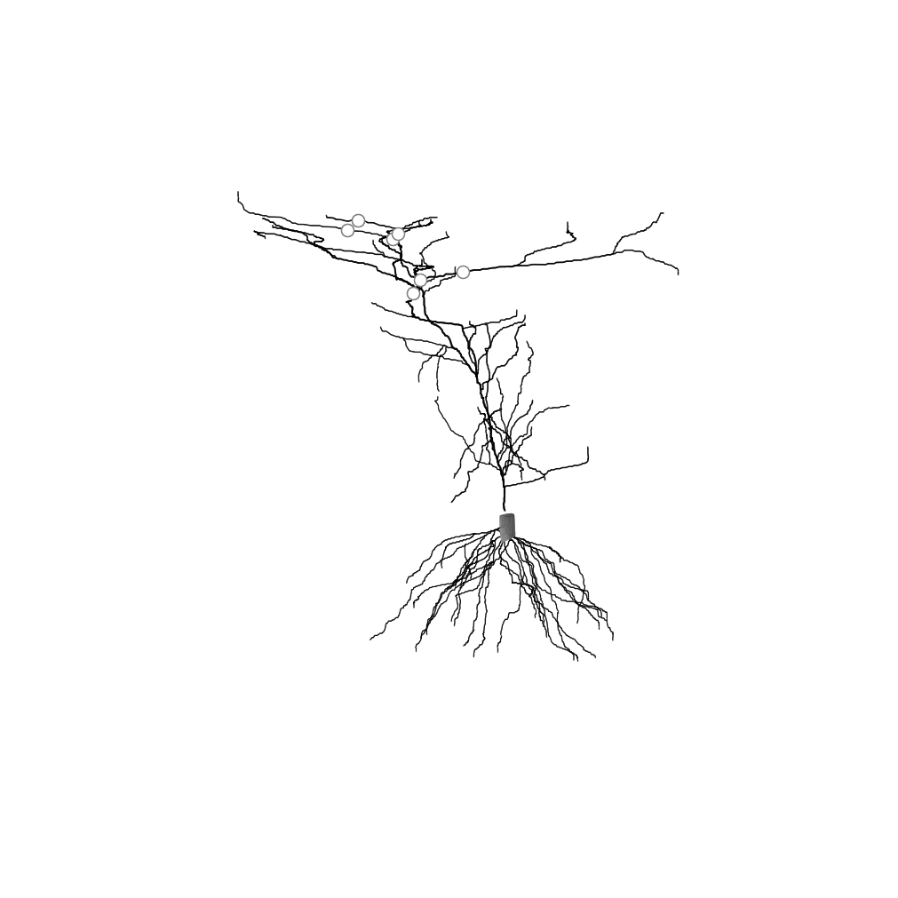

# Phylogram

A minimal package for plotting dendritic morphologies. Supports plotting anatomically and schematically (phylogram).

From the manuscript [Functional architecture of intracellular oscillations in hippocampal dendrites](https://www.nature.com/articles/s41467-024-50546-z) by Zhenrui Liao*, Kevin C. Gonzalez*, Deborah M. Li, Catalina M. Yang, Donald Holder, Natalie E. McClain, Guofeng Zhang, Stephen W. Evans, Mariya Chavarha, Jane Simko, Christopher D. Makinson, Michael Z. Lin, Attila Losonczy & Adrian Negrean. 

## Installation
```
python setup.py install
```

or

```
python setup.py develop
```

or 

```
pip -e PATH/TO/phylogram
```

## Usage 
See `scripts`

## Input
For now only supports [NEURON](https://www.neuron.yale.edu/neuron/) `.hoc` files. Eventually may add `.swc` file support as well

## Output
### Faithful reproduction of morphology


### Schematic morphology

